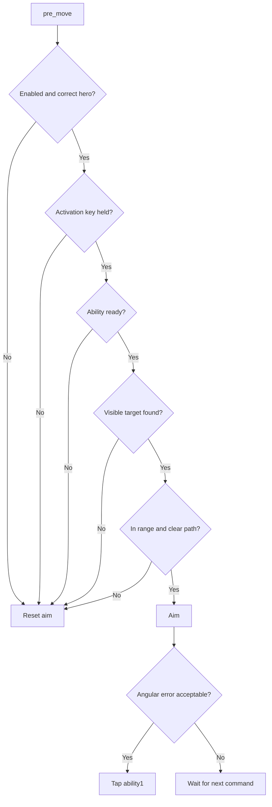

# Hero scripting guide

This guide builds a Haze Sleep Dagger helper. The same structure works for other projectile abilities: keep hero-specific constants together, validate every transient snapshot, and perform aim plus casting during `pre_move`.

## Complete script

Create `C:\znt_dd\haze_dagger_example.lua`:

```lua
-- znt:name Haze Dagger Example

local HERO = "Haze"       -- Hero
local ABILITY_SLOT = 1    -- integer: 1 through 4
local ACTION = "ability1" -- Action

local enabled = true          -- boolean
local aim_style = 0           -- integer: 0 Regular, 1 pSilent
local fov = 120.0             -- number
local activation_key = 0x45   -- integer virtual-key code: E

local function reset()
    znt.hero.reset_aim()
end

znt.events.on("pre_move", function()
    if not enabled or not znt.game.is_hero(HERO) then
        reset()
        return
    end

    if not znt.input.key_down(activation_key) then
        reset()
        return
    end

    local ability = znt.game.ability(ABILITY_SLOT)
    if not ability or not ability.ready or ability.charges == 0 then
        reset()
        return
    end

    local targets = znt.hero.targets(fov, true)
    local target = targets[1]
    if not target then
        reset()
        return
    end

    local projectile = znt.hero.projectile(target.index, fov, ABILITY_SLOT, true)
    if not projectile or not projectile.valid or not projectile.in_range or not projectile.path_clear then
        reset()
        return
    end

    local aim = znt.hero.aim(
        target.index,
        fov,
        4.0,
        4.0,
        ABILITY_SLOT,
        true,
        aim_style
    )

    if aim and aim.error <= 1.0 then
        znt.input.tap(ACTION)
    end
end)

znt.events.on("render", function()
    if enabled and znt.game.is_hero(HERO) then
        znt.draw.fov_circle(fov, 126, 190, 255, 210)
    end
end)

znt.menu.add_hero_tab(HERO, "Haze", function()
    enabled = znt.menu.checkbox("enabled", "Enabled", true)
    aim_style = znt.menu.combo("aim_style", "Aim style", 0, {"Regular", "pSilent"})
    fov = znt.menu.slider_float("fov", "FOV", 120.0, 20.0, 360.0)
    activation_key = znt.menu.keybind("key", "Activation key", 0x45)
end)
```

Load the file from **Scripts → Scripts**, open its hero tab, and hold E while a valid target is inside the configured FOV.

## How the pieces fit



### Gate behavior, not just the tab

`znt.menu.add_hero_tab()` registers the script as champion-specific, supplies the portrait, and keeps its sidebar tab hidden unless the local hero matches. It does not determine whether callbacks execute. `znt.game.is_hero()` keeps the logic dormant for other heroes, so every hero script may remain loaded safely.

### Refresh transient data

Ability readiness, target state, range, and path obstruction can change between commands. The script requests new snapshots inside each `pre_move` instead of retaining old tables as truth.

### Aim and cast in one phase

Both `znt.hero.aim()` and `znt.input.tap()` run during `pre_move`, allowing the prepared aim and cast request to affect the same command.

### Reset every exit path

`znt.hero.reset_aim()` clears script-local smoothing history when activation stops or validation fails. Without it, a later activation may inherit stale target history.

### Separate rendering and controls

The FOV circle is submitted from `render`. Widgets are submitted only from the registered hero-tab callback. This keeps every call inside its valid phase.

## Adapt the script

1. Change `HERO` to a known hero name or ID.
2. Set `ABILITY_SLOT` and `ACTION` to the corresponding ability.
3. Decide whether the projectile should use body-only targeting.
4. Keep range and path checks for projectile abilities.
5. Add ability-specific state only after the basic cast sequence works.
6. For damage-gated actions, require a complete result from [Damage](damage-api.md).
7. Expose only useful settings through [Menu](menu-api.md).

## Next steps

- Review all [Hero assistance](hero-api.md) helpers.
- Learn command timing in [Callbacks](callbacks-api.md).
- Use [Drawing](drawing-api.md) to build custom overlays.
- Compare the patterns listed under [Included scripts](included-scripts.md).
