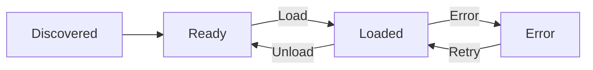

# Lifecycle and safety

Each loaded file receives its own Lua state, globals, callbacks, aim history, and menu tabs.

Globals never cross that boundary. The only script-to-script coordination channel is the boolean [shared-mode API](runtime-api.md#shared-activity-modes), whose values are owned and cleaned up per script.

## Lifecycle



A top-level or callback error unloads only the affected script. Its callbacks and tabs are removed, and its error remains visible in the manager until Retry succeeds.

## Use the correct phase

| Work | Callback |
| --- | --- |
| General read-only updates | `update` |
| Aim and input that must share the current command | `pre_move` |
| Ordinary input and state-machine follow-ups | `post_move` |
| Reactions to queued sounds | `sound` |
| Text, geometry, and specialized overlays | `render` |
| Menu widgets | The registered menu-tab callback |

See [Callbacks](callbacks-api.md) for typed callback signatures.

## Gate hero-specific scripts

A hero tab changes presentation only. It does not control when script logic runs.

```lua
if not znt.game.is_hero("Haze") then
    znt.hero.reset_aim()
    return
end
```

With this guard, every hero script can remain loaded while only the matching logic becomes active.

## Available libraries

Scripts retain safe Lua base, table, string, math, bit, and coroutine functionality. The following capabilities are removed:

- `ffi` and `jit`
- `package`, `require`, and `module`
- `io` and `os`
- `debug`
- `dofile` and `loadfile`

Scripts cannot access arbitrary pointers, process memory, files, DLLs, engine calls, textures, or raw input masks. Supported game mutations are limited to named [Input](input-api.md) actions and constrained [Hero assistance](hero-api.md).


Top-level execution and every callback have a 100,000-instruction limit. Exceeding it unloads the script.


## Handle unavailable data

```lua
local ability = znt.game.ability(1)
if not ability or not ability.ready then
    return
end
```

Do not replace missing data with unsafe assumptions. In particular, an unavailable damage prediction is unknown damage, not zero damage.
